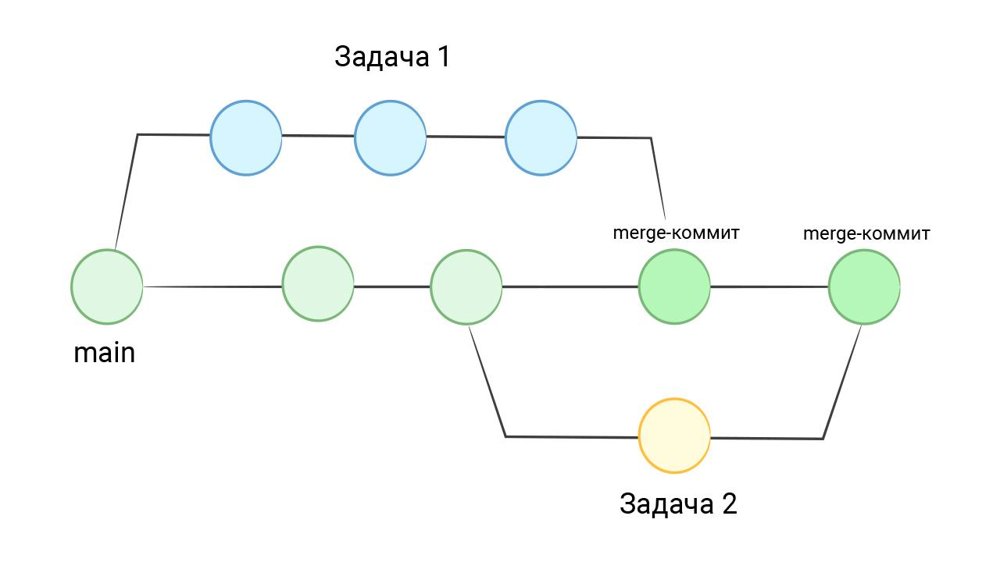

 Понимание Git 

# lesson one§—

## Введение в Git
Обилие команд и возможностей могут повергнуть в ужас любого, кто только начинает изучать Git. Git — это комбайн с невероятным количеством «фич». Но надо ли знать их все? И как их запомнить? Как вообще научиться эффективно его использовать?

Правда состоит в том, что почти никто не знает Git до конца, и разработчики регулярно открывают внутри него что-то новое, а еще постоянно гуглят его команды или смотрят man. Единственный способ изучить Git — постоянно использовать его. Причем наибольший эффект достигается при работе с Git в команде. Одиночная разработка в этом смысле сильно уступает, так как не затрагивает многих сложных ситуаций, возникающих только при совместной работе над одним и тем же кодом.

https://ru.hexlet.io/courses/intro_to_git/lessons/thinking/theory_unit

## работа в команде

Представьте себе, что в один момент времени два разных человека должны делать какие-то длинные задачи, требующие нескольких дней разработки или даже больше. Main-ветка в таком случае должна оставаться рабочей, то есть коммитить промежуточные изменения в нее нельзя, так как изменения могут сломать код. Но коммитить все равно надо, так как просто небезопасно копить изменения в рабочей директории, не отправляя их в Git. Что делать в такой ситуации?

Гит позволяет отпочковываться от основного списка, формируя «ветки». То есть создается отдельный список коммитов, который идет мимо main. В конце разработки все коммиты из такой ветки вливаются обратно в main.

https://ru.hexlet.io/courses/intro_to_git/lessons/thinking/theory_unit

