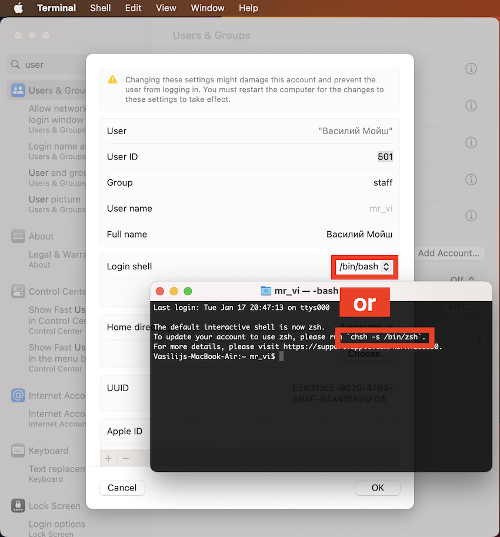

# Terminal on Mac Os

## zsh to bash

[StackExchange:Change Terminal.app's Default Shell to BASH](https://apple.stackexchange.com/questions/7984/change-terminal-apps-default-shell-to-bash)

## .bashrc or .bash_profile for HomeBrew

✅ echo 'export PATH+=:/opt/homebrew/bin' >> ~/.bash_profile 

❌ echo 'export PATH+=:/opt/homebrew/bin' >> ~/.bashcr (it does'n work)[https://apple.stackexchange.com/questions/12993/why-doesnt-bashrc-run-automatically/338622#338622]

